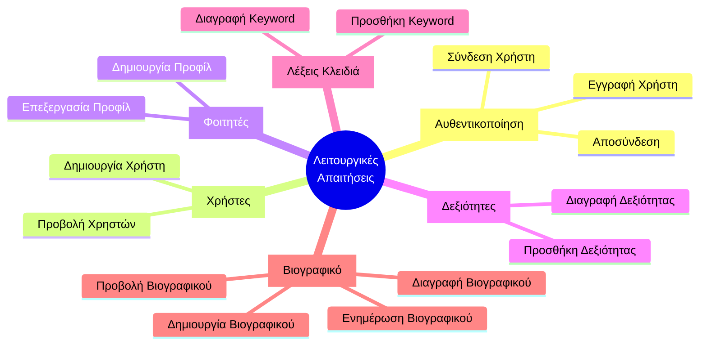
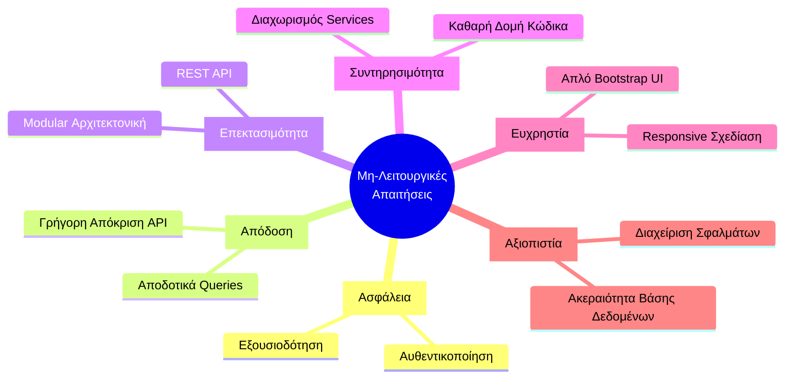
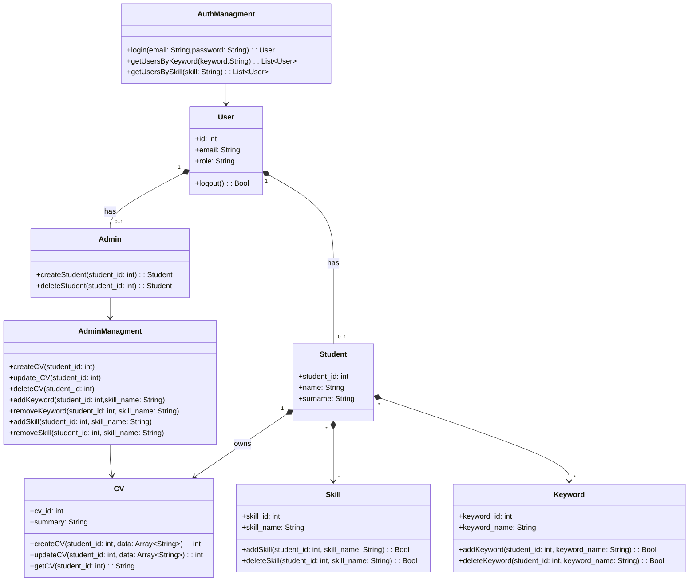
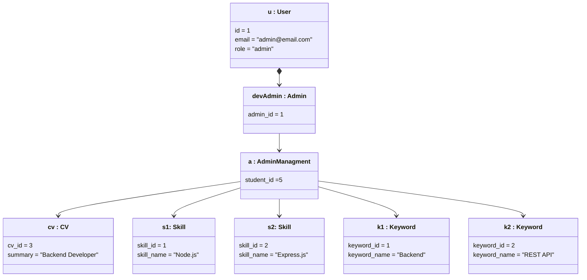
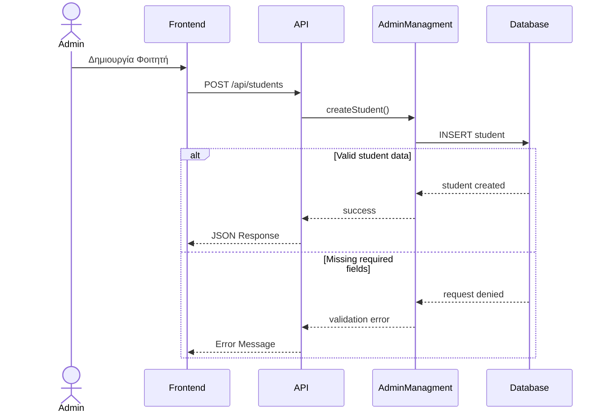

<br><br><br><br><br><br>


<br><br><br><br><br><br>


<br><br><br><br><br><br>

```mermaid
%% ---
%% title: Διάγραμμα ροής Login
%% ---
sequenceDiagram

actor User 
participant Frontend
participant API
participant Service
participant Database

User ->> Frontend : Click login
Frontend ->> API: POST /api/login
API ->> Service: getUserByEmailNPassword()
Service ->> Database: Query user
Database -->> Service : user data 

alt Success
    Service ->> API: RETURNS user OBJECT
    API ->> Frontend: JSON response (success)
    Frontend ->> : Login Success
    
else Failure
    Service -->> API: null / error
    API -->> Frontend: 401 Unathorized
    Frontend -->> User: Login Failed message
end


```
