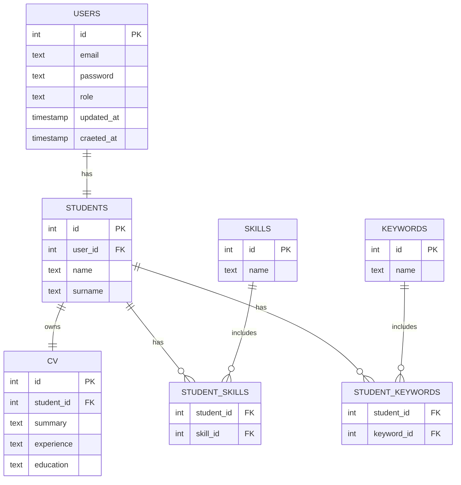

```mermaid
erDiagram

    USERS {
        int id PK
        text email
        text password
        text role
        timestamp updated_at
        timestamp craeted_at
    }

    STUDENTS {
        int id PK
        int user_id FK
        text name
        text surname
    }

    CV {
        int id PK
        int student_id FK
        text summary
        text experience
        text education
    }

    SKILLS {
        int id PK
        text name
    }

    KEYWORDS {
        int id PK
        text name
    }

    STUDENT_SKILLS {
        int student_id FK
        int skill_id FK
    }

    STUDENT_KEYWORDS {
        int student_id FK
        int keyword_id FK
    }

    USERS ||--|| STUDENTS : has
    STUDENTS ||--|| CV : owns

    STUDENTS ||--o{ STUDENT_SKILLS : has
    SKILLS ||--o{ STUDENT_SKILLS : includes

    STUDENTS ||--o{ STUDENT_KEYWORDS : has
    KEYWORDS ||--o{ STUDENT_KEYWORDS : includes
```